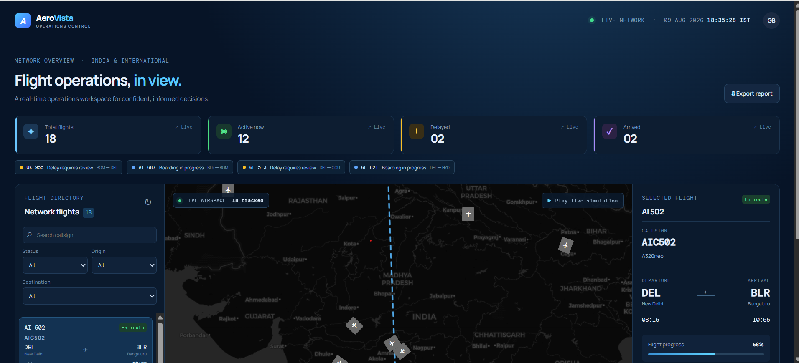
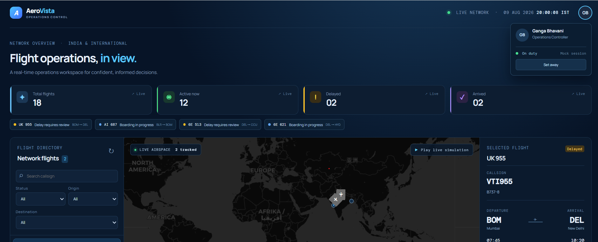
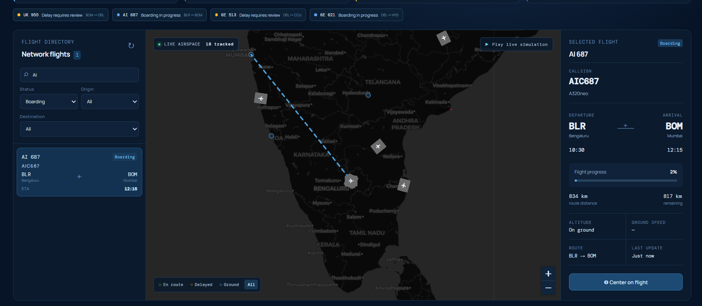
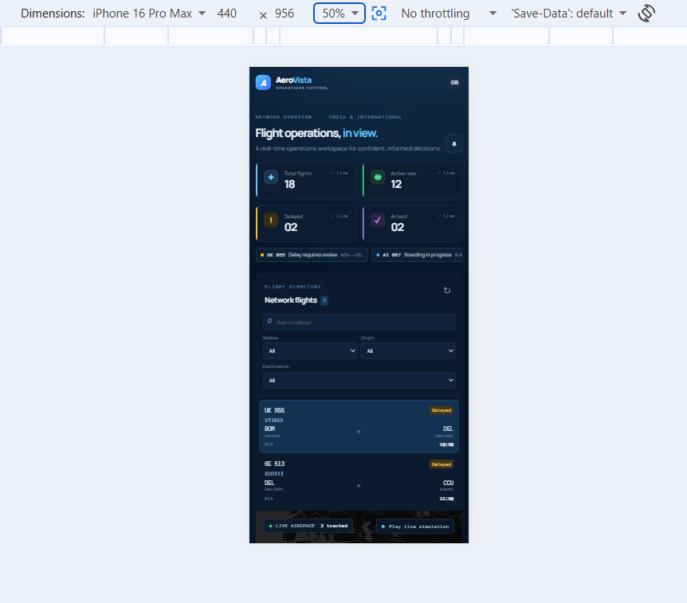
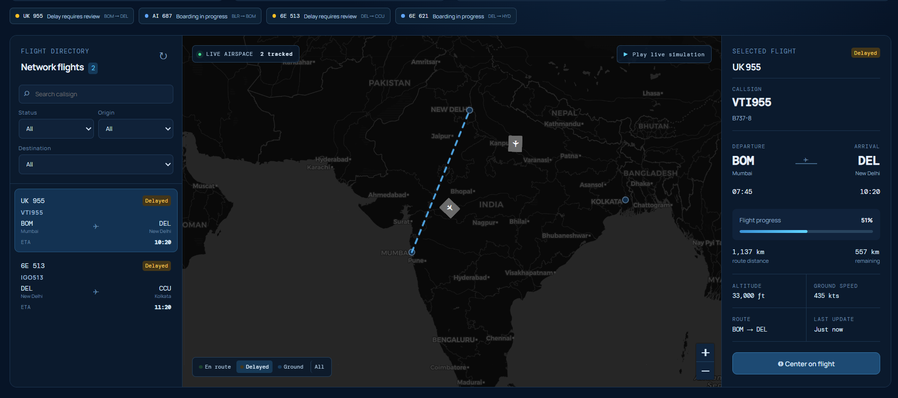

# AeroVista — Flight Operations Dashboard

A responsive aviation operations dashboard designed to provide a clear, interactive view of flight activity, operational status, and aircraft positions. AeroVista keeps the map at the center of the workflow while providing operational context, search, filtering, and flight-level detail at a glance.

  

## Highlights

- 18 realistic mock flights across Indian and international routes
- Interactive Leaflet map with custom aircraft markers, tooltips, selected-route polyline, and animated map centering
- Reactive filters for callsign, status, origin, and destination, powered by Angular Reactive Forms and RxJS
- Operational KPI cards for total, active, delayed, and arrived flights
- Detailed flight panel with schedule, aircraft, progress, altitude, and ground speed
- Responsive three-pane desktop layout that gracefully moves to a map-first tablet/mobile flow
- Strong visual hierarchy, semantic controls, keyboard-friendly native inputs, and status colors paired with text labels
- CSV export for the currently visible flights

## Requirements

- Angular 16+
- TypeScript
- Angular Reactive Forms
- Angular Router
- RxJS
- Leaflet
- Node.js and npm

## Run locally

```bash
npm install
npm start
```

Open `http://localhost:4200`.

To create a production build:

```bash
npm run build
```

## Architecture

```
src/app/
├── core/
│   ├── models/flight.model.ts       # Domain contracts
│   └── services/flight.service.ts   # Mock data + selected-flight state
├── features/dashboard/              # Route-level UI feature
│   ├── dashboard.component.ts       # Reactive view model + Leaflet lifecycle
│   ├── dashboard.component.html
│   └── dashboard.component.scss
├── app.routes.ts                    # Route configuration
└── app.config.ts                    # Application providers
```

The dashboard is a standalone Angular feature exposed through routing. `FlightService` owns the mock feed and selected-flight state as RxJS streams. The component composes the flight feed and reactive form `valueChanges` with `combineLatest`; this makes filters immediate and keeps map, list, KPI, and detail interactions consistent.

## Reactive State & RxJS

The main data flow is:

```
FlightService
     │
     ├── flights$
     │
     └── selected$
            │
            ▼
     Dashboard Component
            │
     ┌──────┴────────┐
     │               │
Reactive Form    Selection
     │               │
     └──────┬────────┘
            ▼
       RxJS view state
            │
     ┌──────┼─────────────┐
     ▼      ▼             ▼
   List     Map      Flight Details
```

The implementation uses:

1. `BehaviorSubject` for shared flight and selected-flight state
2. `combineLatest` to combine flight data and filter changes
3. `debounceTime` for callsign search
4. `distinctUntilChanged` to avoid unnecessary updates
5. `map` for filtering and KPI calculations
6. `startWith` to provide the initial filter state
7. `timer` for the live clock

## Leaflet Map

The dashboard uses Leaflet for geographic flight visualization.
The map includes:
1.Dark CARTO basemap
2.Airport markers with tooltips
3.Custom aircraft markers
4.Status-based aircraft marker styling
5.Aircraft heading rotation
6.Selected-flight route polyline
7.Flight tooltips
8.Map centering for selected flights
9.Map status filtering

Leaflet is initialized after the map container is rendered and cleaned up when the dashboard is destroyed.

The map tiles require an internet connection. Flight data itself is local and does not depend on an external API.

## Mock Flight Simulation

Because the application does not require a backend, the live-flight behavior is implemented as a frontend simulation.

When the simulation is started:

1.En-route flights move incrementally toward their destinations.
2.Flight progress is updated.
3.The updated flight collection is published through FlightService.
4.The KPI cards, flight list, selected-flight details, and Leaflet markers react to the updated state.

This demonstrates how the application could later consume a real-time API or WebSocket feed.

## Design rationale

Operations work is time-sensitive, so the interface prioritizes signal over decoration. The high-contrast navy map canvas is the focal point; bright cyan is reserved for interactive and selected state, while green, amber, and violet communicate flight states. The three panes mirror the user’s natural flow: narrow the network, inspect geographic context, then review the selected flight. Dense information is grouped with restrained borders, monospace data labels, and a consistent spacing scale to keep it scannable.

On tablets the details panel yields space to the map; on small screens the list precedes a full-width map. The map uses CARTO’s dark basemap, so it requires an internet connection for map tiles; all flight data is local mock data.

## Suggested project walkthrough

1. Start with the KPI strip and explain how it derives from the shared RxJS flight stream.
2. Search `AIC` or filter `Delayed`; show the list and markers updating together.
3. Select a flight in the list or on the map to demonstrate route rendering, map centering, and the details card.
4. Resize to tablet width to highlight the responsive layout.

## Future enhancements

The boundary between `FlightService` and the feature makes a live API/WebSocket feed an incremental change. Marker clustering, weather layers, timeline playback, and route-aware great-circle paths would be natural next iterations.

## Screenshots

### Dashboard Overview



### Dashboard with Operator Profile



### Search and Filtering



### Mobile Responsive Layout



### Selected Flight and Route


